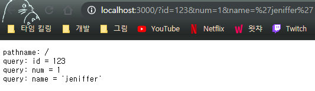
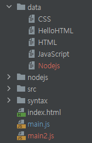

# 생활코딩 WEB2 - Node.js 스터디

- ### 유튜브 강좌

  [WEB2 - Node.js](https://www.youtube.com/playlist?list=PLuHgQVnccGMA9QQX5wqj6ThK7t2tsGxjm)

  ## 2021-05-04

  ### 5. Node.js로 웹서버 만들기

  **5.1 Hello world!**

  - node.js가 제공하는 `http` 모듈의 `createServer`를 이용해서 서버를 만들 수 있음.
    - createServer는 callback 함수를 인자로 받고, 서버 생성 후 이걸 실행시킴
  - 브라우저에서 보이는 것은 서버에서 보낸 response, 즉 `res`에 들어있는 데이터임.

  ```jsx
  // Node.js의 http 모듈 불러오기
  var http = require('http')
  
  // 서버 만들기
  var app = http.createServer(function(req, res){
  	  // req = reqeust, res = response
      // 브라우저에 데이터를 보내기
      res.end('hello world!')
  });
  
  // 대기타면서 request를 계속 받기
  app.listen(port=3000)
  ```

  

  **5.2 URL의 구성요소**

  - `{protocol}://{host}:{port}/{path}?{querystring}` (ex) `http://opentutorials.org:3000/main?id=HTML&page=12`→ main이 path, id, page가 querystring

  ※ 참고: [어디서는 URL이라고 부르고, 어디서는 URI라고 부르는데 URL과 URI의 차이는?](https://velog.io/@jch9537/URI-URL)

  **5.3 pathname과 querystring 사용하기**

  - pathname과 querystring을 url에서 꺼내려면 node.js의 `url` 모듈의 `parse`를 사용해야함.
  - pathname은 string 형식이어서 그냥 출력할 수 있음

  ```jsx
  var http = require('http')
  var url = require('url')                            // url을 parsing하려면 Node.js의 url 모듈이 필요하다
  
  var app = http.createServer(function(req, res){
      var _url = req.url
      var pathname = url.parse(_url, true).pathname   // pathname 추출
      var query = url.parse(_url, true).query         // query 추출
  
      var text = ''
      text += `pathname: ${pathname}\\n`               // pathname은 그냥 string으로 가져와짐
  
      for (var key in query){                         // query는 여러개 있을 수 있어서 dictObject로 가져와짐
          text += `query: ${key} = ${query[key]}\\n`
      }
      res.end(text)
  })
  
  app.listen(port=3000)
  
  // <http://localhost:3000/my/path/to/somewhere?id=1&name=flowerk>
  // pathname: /my/path/to/somewhere
  // query: id = 1
  // query: name = flowerk
  ```

  

  ※ 참고: url을 프린트하면 다음과 같은 내용이 들어있다.

  ```json
  Url {
    protocol: null,
    slashes: null,
    auth: null,
    host: null,
    port: null,
    hostname: null,
    hash: null,
    search: '?id=HTML',
    query: [Object: null prototype] { id: 'HTML' },
    pathname: '/',
    path: '/?id=HTML',
    href: '/?id=HTML'
  }
  ```

  ## 2021-05-07

  ### **11. App 제작 - 동적인 웹페이지 만들기**

  - Query String을 사용하면 동적인 웹페이지를 간단히 만들 수 있다.

  ### 12. Node.js의 파일 읽기 기능

  - 파일을 읽고싶다면, Nojde.js의 `fs` 모듈에서 `readFile` 를 사용하면 된다.
  - 그리고 이걸 이용해서 디렉토리를 체계적이고 간단하게 할 수 있다. 동적인 페이지들을 data 폴더로 몰아버리면 됨.

  

  - 또, 이러면 새로 페이지를 만들 때마다 app.js를 재시작 할 필요가 없다. 페이지 링크를 누르면 그 때 파일을 읽어 페이지 내용을 보기 때문이다.

  ```jsx
  var http = require('http')
  var url = require('url')
  var fs = require('fs')
  
  var app = http.createServer(function(req, res){
      var _url = req.url;
      var query = url.parse(_url, true).query;
      var pathname = url.parse(_url, true).pathname;
  
  		// desc에 들어가는 내용을 출력해보자
      var desc
      fs.readFile(`data/${query.id}`, 'utf-8', function (err, desc) {
  				// id가 있으면 내용을 desc에 넣음
  				// id가 undefined면 query가 없는거니까 홈화면
  				// 한글 파일 불러올때는 'utf-8'로 해야함. 근데 HTML 형식을 보내는게 아니라 res.end를 하는거면 여전히 깨질 것.
          if(query.id === undefined){
              desc = 'Hello, world!'
          }
          res.end(desc)
      })
  })
  
  app.listen(port=3000)
  ```

  ### **18. Node.js 콘솔에서의 입력값**

  - node에 console에서 파라미터를 줄 때는 `process.argv`를 사용하면 된다.

  ### **19. App 제작 - Not Found 구현, 홈페이지 구현**

  - 전통적 약속: 제대로 된 pathname을 줬을 경우 200을, 아니면 404를 준다.
  - 404를 줘야 할 경우 not found 페이지를 따로 만들어서 불러오는 것을 해봤다!

  ```jsx
  var app = http.createServer(function(request,response){
  		...
  		// (홈화면 로딩 내용)
  		...
      if(pathname === '/') {
  		...
  		// (홈화면 로딩 내용2)
  		...
      } else {
        response.writeHead(404);
        fs.readFile('src/not_found.html', 'utf-8', function (err, description){
           response.end(description);
        })
      }
  })
  ```

  - 강좌보다 더 간단하게 할 수 있는 방법이 있을 것 같아서... 중복을 없애고 컨디션을 넣었다.

  ### **23. Node.js에서 파일목록 알아내기**

  - 파일 목록은 `fs.readdir`를 사용하면 된다. 파이썬의 `os.listdir`과 똑같다.
  - 이걸로 홈화면에 파일 리스트를 보여줄 수 있다.

  ## 2021-05-14

  ### **28. 동기와 비동기, 콜백**

  - 동기(Sync)와 비동기(aSync)에 대해서 알았다.
  - 콜백 함수를 어떻게 쓰는지 알겠다. 특히 인자를 넘기는게 어떻게 하는건지 궁금했는데, 다음 처럼 테스팅을 해보니 좀 이해가 됨

  ```jsx
  var names = ['Miku', 'Rin', 'Ren']
  names.forEach(function(name, index){
  	console.log(name, index)
  })
  // Mike 0
  // Rin 1
  // Ren 2
  
  names.forEach(function(name){
  	console.log(name)
  })
  // Mike
  // Rin
  // Ren
  ```

  ### **29. Node.js의 패키지 매니저와 PM2**

  - PM2는 사용법을 알아두면 굉장히 편할 것 같다.

  ### **44. 모듈의 형식**

  - 이 두 개가 다르네?

  ```jsx
  var M = {
      v: 'v',
      f: function() {
          console.log(this.v)
      }
  }
  
  M.f()  // 'v'
  
  var M = {
      v: 'v',
      f: () => {
          console.log(this.v)
      }
  }
  
  M.f()  // undefined
  ```

  ### **46. 입력 정보에 대한 보안**

  - 외부에서 정보가 들어오는 경우, 즉 pathname이나 querystring이 들어오는 경우는 매우 조심해야한다.
  - 예를 들어 `fs.readFile(`data/${query}`)`에서 query를 `'../password.js'`로 넣으면, 원래 있으려던 data 디렉토리를 벗어나 다른 파일을 보게 된다. 여기서 `'../../../'` 이런 식으로 가면 완전히 벗어나서 우리 컴퓨터를 다 볼 수도 있음.
  - 이 문제를 해결하려면 `path.parse(${query}).base`를 사용하면 된다.

  ```jsx
  > var path = require('path')
  > path.parse('../password.js')
  {
    root: '',
    dir: '..',
    base: 'password.js',
    ext: '.js',
    name: 'password'
  }
  ```

  ### **47. 출력 정보에 대한 보안**

  - XSS (Cross-Site Scripting) 공격: 입력으로 `<script> 악성 스트립트 </script>` 를 받고 출력하는 경우, 안쪽에 있는 악성 스크립트가 그대로 HTML에 들어가면서 실행된다.
  - 예를 들어, `<script> localtion.href = '<https://naver.com>'; </script>` 를 입력하여 페이지가 출력하게 하면, 자동으로 네이버로 가게 된다.
  - 그래서 '<', '>' 같은 문자들을 대치하는 코드를 넣어놓는다.
  - sanitize-html 같은 것을 사용할 수 있다.