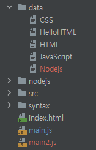

# NodeJS-Sandbox

| 디렉토리명                 | 설명                                                         | 날짜             |
| -------------------------- | ------------------------------------------------------------ | ---------------- |
| HelloWorld                 | Node.js를 처음 사용해보고, express로 서버를 만들어보고, MySQL에서 데이터를 읽어보는 프로젝트 | 2021.04.26~04.30 |
| OpenTutorials-WEB2-Node.js | 생활코딩 WEB2 - Node.js 스터디                               | 2021.05.04~      |


### 🌸2021-04-26

- node.js를 처음 시작했다. 
- npm, nvm으로 package 관리하는 법을 알았다.


### 🌸2021-04-27

- express로 API 서버 만드는 법을 알았다. 
- GET, DELETE, POST API 만들고, 파라미터를 설정하는 법을 알았다.


### 🌸2021-04-29

- 라우팅으로 API를 관리하는 법을 배웠다. express-generator를 많이 참고하고있다.
- 아직 DB랑 연동하는 법은 모르겠다.


### 🌸2021-04-30

- MySQL의 DB에서 데이터를 읽어오는 API를 만들 수 있게 되었다 (routes/memo.js).
- express를 express-generator 없이 쓰면서 routes 디렉토리를 만들었다.
- POSTMAN 쓰는 법을 알았다.
- 아직 www 디렉토리는 어떻게 작동하는지 모르겠다. 


### 🌸2021-05-03

- 생활코딩 WEB1-HTML에서 HTML 읽는 법, 쓰는 법을 배웠다. 
- 생활코딩 WEB2-Node.js 공부를 시작했다. WEB3-express에 MySQL을 사용해보고싶어서 순서대로 공부 할 생각이다.
- 

### 🌸 2021-05-04

- Hello world 서버 만들기

  ```jsx
  // Node.js의 http 모듈을 이용해서 서버를 만들 수 있음
  var http = require('http')
  
  // 'hello world!'를 띄우는 서버 정의
  var app = http.createServer(function(req, res){
      // res.end에 태워서 보내는 것이 실제 브라우저에서 보이는 것
      res.end('hello world!')
  });
  
  // 대기타면서 request를 계속 받기
  app.listen(port=3000)
  ```

  

- URL 구성

  

  ※ URL과 URI의 차이는?

  [URI & URL 차이](https://velog.io/@jch9537/URI-URL)

- Pathname(=host, domain), Query string 사용법

  - url은 `request.url`로 불러온다.
  - url에서 `url.parse` 로 query string, pathname을 분리할 수 있다. → parse는 deprecated

  ```jsx
  var http = require('http')
  var url = require('url')                            // url을 parsing하려면 Node.js의 url 모듈이 필요하다
  
  var app = http.createServer(function(req, res){
      var _url = req.url
      var query = url.parse(_url, true).query
      var pathname = url.parse(_url, true).pathname
  
      var text = ''
      text += `pathname: ${pathname}\\n`               // pathname은 그냥 string으로 가져와짐
      for (var key in query){                         // query는 여러개 있을 수 있어서 dictObject로 가져와짐
          text += `query: ${key} = ${query[key]}\\n`
      }
      res.end(text)
  })
  
  app.listen(port=3000)
  ```

  

### 🌸 2021-05-07

**11. App 제작 - 동적인 웹페이지 만들기**

- Query string에 따라 동적인 페이지를 만들 수 있게 되었다.

**12. Node.js의 파일 읽기 기능**

- Nojde.js의 fs 모듈을 사용하면, 파일 내용을 `fs.readFile`로 읽어서 표시할 수 있다.

- 이걸 이용해서 디렉토리를 체계적이고 간단하게 할 수 있다.

  

- 이러면 새로 페이지를 만들 때마다 app.js를 재시작 할 필요 없이 그냥 로딩만 다시 하면 된다.

  ```jsx
  var http = require('http')
  var url = require('url')
  var fs = require('fs')
  
  var app = http.createServer(function(req, res){
      var _url = req.url;
      var query = url.parse(_url, true).query;
      var pathname = url.parse(_url, true).pathname;
  
  		// desc에 들어가는 내용을 출력해보자
      var desc
      fs.readFile(`data/${query.id}`, 'utf-8', function (err, desc) {
  				// id가 있으면 내용을 desc에 넣음
  				// id가 undefined면 query가 없는거니까 홈화면
  				// 한글 파일 불러올때는 'utf-8'로 해야함. 근데 HTML 형식을 보내는게 아니라 res.end를 하는거면 여전히 깨질 것.
          if(query.id === undefined){
              desc = 'Hello, world!'
          }
          res.end(desc)
      })
  })
  
  app.listen(port=3000)
  ```

**18. Node.js 콘솔에서의 입력값**

- node에 console에서 파라미터를 줄 때는 `process.argv`를 사용하면 된다.

**19. App 제작 - Not Found 구현, 홈페이지 구현**

- url을 프린트하면 다음과 같은 내용이 들어있다.

  ```json
  Url {
    protocol: null,
    slashes: null,
    auth: null,
    host: null,
    port: null,
    hostname: null,
    hash: null,
    search: '?id=HTML',
    query: [Object: null prototype] { id: 'HTML' },
    pathname: '/',
    path: '/?id=HTML',
    href: '/?id=HTML'
  }
  ```

- 전통적 약속: 제대로 된 pathname을 줬을 경우 200을, 아니면 404를 준다.

- 404를 줘야 할 경우 not found 페이지를 따로 만들어서 불러오는 것을 해봤다!

- 강좌보다 더 간단하게 할 수 있는 방법이 있을 것 같아서... 중복을 없애고 컨디션을 넣었다.

**23. Node.js에서 파일목록 알아내기**

- 파일 목록은 `fs.readdir`를 사용하면 된다. 파이썬의 `os.listdir`과 똑같다.